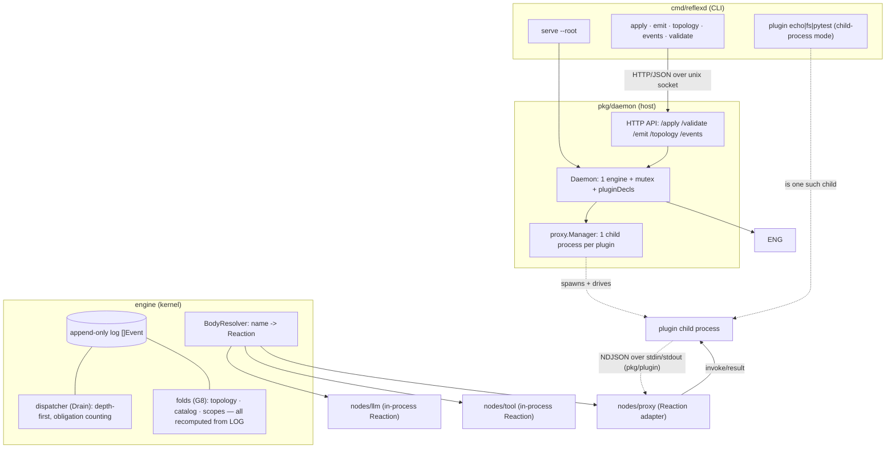
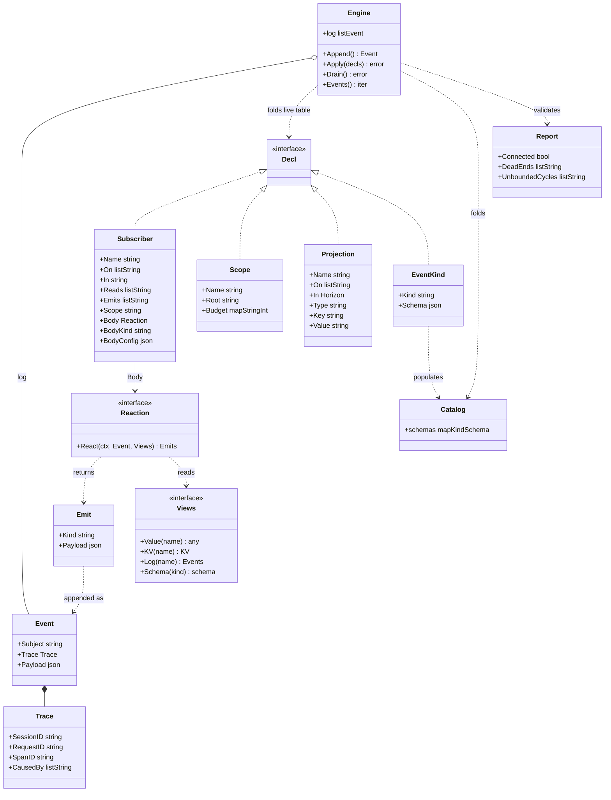
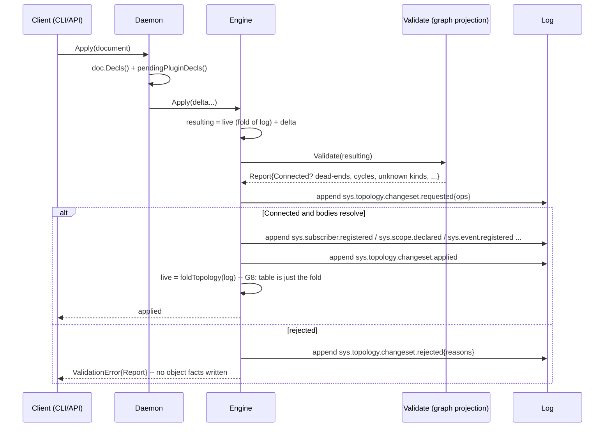
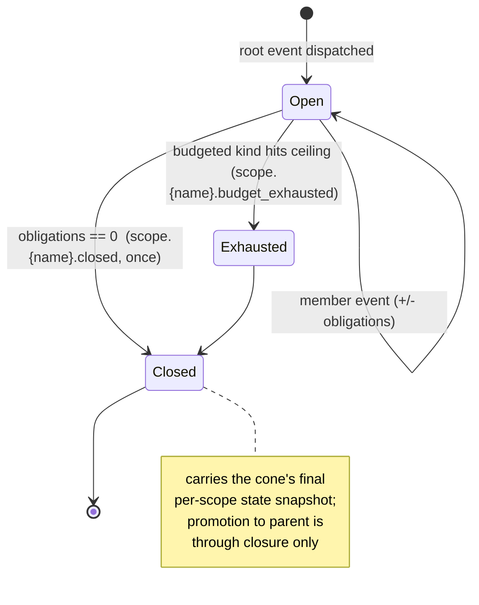

# ARCHITECTURE — the reflex stack as built (diagrams)

> **Status: CANONICAL / current.** Read [`CONCEPT.md`](./CONCEPT.md) for the
> *model and the why*; this doc is the *shape of the code as it stands* — domain
> model and the main sequences, in diagrams, minimal prose. When the two
> disagree, `CONCEPT.md` wins on model and this doc is fixed to match the code.

The whole system is **three primitives** (Event, Reaction, Projection) over one
append-only log, plus a control plane that is *itself* events on that log. Below:
the layers, the domain model, then the four sequences that matter (apply a
topology, launch a plugin, reconcile an external event, close a scope).

---

## 1. Layers (what runs where)



- **One write path:** everything reaches the log through `engine.Append`
  (an external event) or the engine's own fact writes (dispatch emits, changeset facts).
- **Nothing is a store.** Topology, catalog, scope state are *folds over the
  log* (G8). The cached `live` table is a memoisation of `foldTopology(log)`.
- **The only non-fact part is a `Reaction` body** (Go code) — resolved by name
  via `BodyResolver`. `llm`/`tool` run in-process; a plugin runs as a child
  process behind a `proxy` Reaction.

---

## 2. Domain model



Legend for the abbreviated types: `listX` = `[]X`, `mapStringInt` =
`map[string]int`, `mapKindSchema` = `kind -> schema`.

- **`Subject`** is `{class}.{scope...}.{kind...}`; **`Trace.CausedBy`** is
  engine-stamped, never sender-chosen.
- **Wiring unit = `Subscriber`** (`On` kinds it hears, `In` scope qualifier,
  `Emits` allowlist, `Reaction` body, optional `Scope` rooting). There is no
  "node" primitive — "node"/"edge" exist only in the connectivity-graph
  *projection* (the validator, §6).
- A `Subscriber` sets **either** a live `Body` (in-process) **or** a
  `BodyKind`+`BodyConfig` descriptor (rebuilt from the log via the resolver, G8).
- `Decl` is the managed-object union a changeset adds/removes: `Subscriber`,
  `Scope`, `Projection`, `EventKind`. `EventKind` populates the `Catalog`.

---

## 3. Control plane — apply a topology (changeset is events on the log)

A client never mutates the live table; it *requests a changeset*. The engine
validates the **whole resulting graph** (live + delta) and, only on success,
writes the facts the live table folds.



- **No drain here.** The facts are dispatched on the next `Drain` like any event
  — an audit subscriber of `sys.*` sees them.
- `Validate` is the same function in dry-run (`/validate`): folds, checks,
  appends nothing.

---

## 4. Register a plugin (the process) + declare a handler (the wiring)

Two distinct concerns. A top-level **`plugins:`** section **registers the external
process** — its spawn command + transport — scope-agnostic infra; the plugin
announces "I handle these kinds (schemas), I emit these kinds (schemas)", which the
daemon turns into **catalog kinds**. *Using* a hand is a separate operator-graph
concern: a **normal `Subscriber` named after the tool-call kind it serves** (e.g.
`tool.fs.read.call`), scoped `in: request`, with **no plugin reference**. The
daemon backs that subscriber with whichever registered plugin **handles its kind** —
the link is the kind, not a name — and defaults its `Emits` to the plugin's
produced `*.result/failed`.

```mermaid
sequenceDiagram
  participant D as Daemon
  participant M as proxy.Manager
  participant P as Plugin child

  D->>M: Launch (reflexd plugin fs, root=/testbed)
  M->>P: spawn over stdio
  P-->>M: hello (name, events in/out with schemas, protocol)
  M-->>P: welcome
  M->>M: derive EventKind per declared kind and schema (in and out) — catalog only
  M-->>D: return name and catalog decls
  Note over D,P: the operator declares a handler subscriber (On=the tool-call kind, In=request)
  Note over D,P: Apply binds that subscriber to the plugin that handles its kind; validates the whole graph
```

- **The handler's scope is the operator's choice** (`in: request` puts a hand
  inside the budgeted loop); the engine places its result in the trigger's cone by
  causality.
- `--root` is a **host concern** (`serve --root` → `reflexd plugin fs --root`),
  never an operator-topology config.
- On restart, `engine.Load` rebuilds the `Subscriber` from
  `sys.subscriber.registered` and the resolver re-spawns the process from the
  registered plugin (G8).

---

## 5. Reconcile an external event — Drain, with a hop out to a plugin

One externally appended event (a plain registered domain event — there is no
"ingress" class), drained to quiescence. Dispatch is **depth-first**: a child's
obligations are counted before the parent's are released, so a cone closes
exactly once.

```mermaid
sequenceDiagram
  participant U as Caller
  participant E as Engine (Drain)
  participant R as resolver (Subscriber)
  participant B as brain (llm, in-process)
  participant FS as fs (proxy -> child process)
  participant T as terminal (sink)
  participant L as Log

  U->>E: Emit cli.task (drain=true)   %% a registered domain kind, produced by no subscriber
  E->>L: append external event
  E->>R: deliver (On "cli.task" matches; resolver is a root)
  R-->>E: Emit request.received (roots scope request)
  E->>L: append (caused_by the external event), scope request opens, obligations +1
  E->>B: deliver request.received (in scope)
  B-->>E: Emit tool.fs.read.call (allowlisted, schema from catalog)
  E->>FS: deliver tool.fs.read.call (handler subscriber, in request)
  FS->>FS: child reads file, returns emits
  FS-->>E: Emit tool.fs.read.result
  E->>B: deliver result (loop until a brain turn calls no function — its llm.message claim — then verifier + judge gate done)
  Note over E: depth-first, each emit is processed as a child before its parent leaves the cone
  E->>E: obligations of request reach 0
  E->>L: append scope.request.closed (once, in the parent cone)
  E->>T: deliver scope.request.closed / terminal state
  E-->>U: produced events (incl. the terminal fact)
```

- **The loop is event closure**, bounded by a `Budget` on the `request` scope —
  the termination backstop. The `brain` reads its history *view* (a Projection)
  at each firing; it replays the model's own tool calls and results as
  **structured function-call / function-response parts** (the function name is the
  event kind), not text — required for reliable multi-turn function calling on
  Gemini. A thinking model's per-call `thoughtSignature` rides on the call event
  via an engine-blind `Meta` channel (`Emit`/`Event` carry an opaque `Meta` field)
  and is echoed back on replay, or the API rejects the request.
- **Out-of-process is not out-of-bounds:** the engine still binds the plugin's
  emits to the `Subscriber`'s `Emits` allowlist, and runs payload-conformance
  against the catalog schema.

---

## 6. Two projections over the log worth naming

These are *views*, recomputed from the log — not stores.

**Scope lifecycle** (the built-in progress projection):



**Connectivity graph** (the validator — the *only* place "node"/"edge" live):
subscribers become graph nodes, "X emits a kind Y subscribes to" becomes an
edge; the `Report` flags dead-ends, unreachable nodes, fragments, unbounded
cycles, stalled closures, co-rooted scopes, unknown kinds, dead subscriptions.

---

## 7. Status (what these diagrams reflect)

- **Built & green:** the engine (append/drain, scopes/budgets/closure,
  projections, catalog), `llm`/`tool` bodies, the daemon + control plane + HTTP
  API, the stdio plugin seam, `fs`/`pytest`/`echo` plugins, plugins that
  self-describe their kinds (operator-declared handler wiring), the `Subscriber`
  substrate naming. **No `app.ingress` class** — an
  external event is a plain registered domain event; a root is structural
  (`isRoot`). **Always-on catalog**, with the engine self-registering its own
  kinds (seed + per-scope `scope.*.closed`/`.budget_exhausted`), so the operator
  declares only domain kinds (the *Finding (3a)* follow-up, now done).
- **Pending (known):** Iteration 4 (express the coding-agent topology, real
  model) and Iteration 5 (SWE-bench instance end-to-end).
